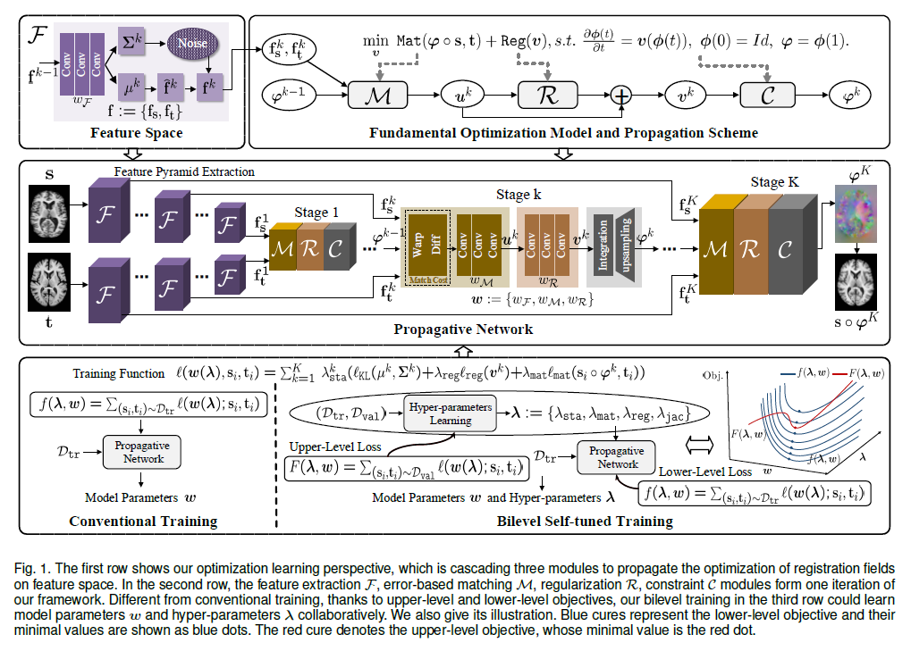

# MultiPropReg

The code is still being sorted......

This is the official code for "Learning Deformable Image Registration from Optimization: Perspective, Modules, Bilevel Training and Beyond"

# Requirements

> Python == 3.6.8, PyTorch == 0.3.1, torchvision == 0.2.0   

> Note: PyTorch 0.4 is not supported at this moment and would lead to OOM.   

# Pretrained models

> The easiest way to get started is to evaluate our trained models, run

> 
 <code>python test.py</code> 

# Reference
If you find our work useful in your research please consider citing our paper:

@ARTICLE{9551747, <\br>
  author={Liu, Risheng and Li, Zi and Fan, Xin and Zhao, Chenying and Huang, Hao and Luo, Zhongxuan},<\br>
  journal={IEEE Transactions on Pattern Analysis and Machine Intelligence}, <\br>
  title={Learning Deformable Image Registration from Optimization: Perspective, Modules, Bilevel Training and Beyond}, <\br>
  year={2021},<\br>
  volume={},<\br>
  number={},<\br>
  pages={1-1},<\br>
  doi={10.1109/TPAMI.2021.3115825}}<\br>
